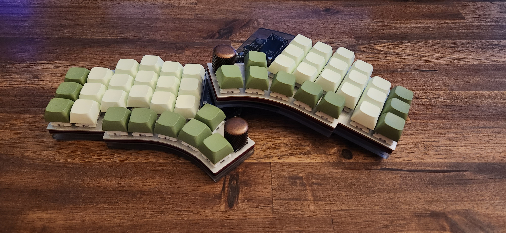

# Kyria Keyboard Firmware

Firmware config and keymap for my custom split, ergonomic, mechanical keyboard,
the [kyria](https://splitkb.com/products/kyria-rev3-pcb-kit).

The base firmware is [ZMK](https://zmk.dev/). One day, I will get around to writing my own firmware
in Rust.

## Photo

## Keymap

